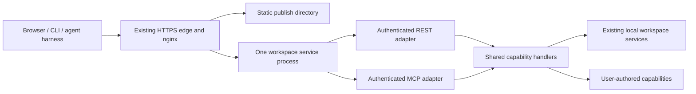

# SPEC-001 — Extensible VibeStack service host

- State: draft
- Initiative: [Agent platform](../initiatives/agent-platform.md)
- Owner: project owner for product decisions; Codex for this drafting pass
- Updated: 2026-09-21
- Decision authority: user requires static hosting, an authenticated API, authenticated MCP and an easy way to add endpoints/tools; implementation details below are recommendations
- Supersedes: the public-machine-broker draft of SPEC-001 and the retired combined agent-access proposal
- Planning ticket: [VST-004](../tickets/VST-004.md)

This specifies target behavior. It does not claim the new service is implemented.

## Outcome and user journeys

Each VibeStack instance provides one service URL. It hosts static files, an
authenticated REST API and an authenticated MCP endpoint. A user or agent can
add a capability while building, expose it as an API endpoint and MCP tool, and
use it through the CLI or web application without designing a new service stack.

An agent starts at `CODESPACE_URL/AGENTS.md`, as defined in
[SPEC-002](SPEC-002-rest-api-agent-distribution.md). It learns how to authenticate,
discover capabilities and connect its preferred client. One deployment initially
serves one workspace and its trusted owner/clients; no machine selection is needed.

Example: add a `project_summary` capability that reports selected project metadata.
After an explicit build/restart, its REST endpoint and MCP tool use the same
handler, authorization, schema and result. Discovery and the CLI can find it;
adding a page to the configured static directory requires no nginx route edit.

## Audit of the previous approach

The earlier draft designed a hosted fleet-management product. Machine enrollment,
outbound tunnels, certificate issuance, a PostgreSQL registry, session fencing and
cross-machine dispatch recovery solve requirements outside this service host.
They add deployment dependencies and postpone the first useful endpoint/tool.

The useful foundations already exist: nginx hosts files and proxies local
services; `automation/server.py` provides bearer-authenticated workspace actions;
`runner/mcp.go` demonstrates the installed Go MCP SDK and reuse of operation
handlers. The missing pieces are a direct workspace MCP entry point, a consistent
authenticated service boundary and a documented extension path.

## Scope and exclusions

Deliver static hosting, shared API/MCP authentication and operation dispatch,
capability registration, client discovery and a repeatable Codespaces deployment.
CLI/bootstrap details belong to SPEC-002; MCP interoperability to
[SPEC-003](SPEC-003-authenticated-mcp.md); the chat UI to
[SPEC-004](SPEC-004-chat-agent-interface.md).

Machine enrollment, reverse tunnels, a central registry, cross-owner tenancy,
certificate infrastructure and remote Docker provisioning are outside this phase.
The existing private host runner remains a separate optional product component.
Neither a database server nor a queue is required to host these three surfaces.

## Contract

### Topology



Reuse nginx and the platform HTTPS edge. Add one workspace application process,
recommended as `cmd/vibestack-service` in Go, using the existing Go toolchain and
MCP SDK. REST and MCP are handlers in that process, not independent deployments.
Keep existing Python execution/file/job services behind explicit local adapters;
this proposal does not rewrite the desktop stack or route through the host runner.
The application does not receive the Docker socket.

| Surface | Responsibility | Access |
| --- | --- | --- |
| `/`, `/assets/`, `/AGENTS.md`, published guide/download files | Serve the configured static site and versioned guidance | Sanitized files may be readable without application login; the outer private gateway still applies |
| `/.well-known/vibestack` and advertised schemas/auth metadata | Service identity, version and supported connection methods | No private files, credentials or workspace state |
| `/api/v1/...` | Authenticated workspace capabilities and compatibility routes | Shared application authentication and authorization |
| `/mcp` | MCP transport for those capabilities | Shared application authentication and authorization; client protocol requirements in SPEC-003 |

All backend listeners remain loopback/internal. Route authentication is mandatory
before dispatch, including new module routes and legacy API aliases. Unknown
routes return an error; they must not fall through to an old unauthenticated
handler or the static site's index page. nginx handles file delivery and proxying;
the application owns identity and capability policy.

### Authentication without a new identity platform

Start with one trusted workspace owner and revocable client credentials. Reuse
the existing protected credential-storage pattern for a small personal-token
configuration; no new database service or user-management product is needed.
A token represents control of this workspace, not of the Docker host. Credential
creation/rotation is an authenticated owner or local operator action, never an
anonymous public pairing endpoint. Provision credentials outside Git and prompts.

API and MCP resolve the same principal and use the same capability checks.
Missing/invalid credentials fail before execution; revocation denies subsequent
requests, including requests on existing MCP connections. Credentials are never
accepted in query strings. Internal calls use protected service credentials,
not forwarded external access tokens. Broad command execution already conveys
workspace authority; narrower tool lists are not a sandbox for that authority.

For clients supporting configured bearer credentials, document and test that
connection mode. For MCP clients requiring OAuth discovery and consent, integrate
an established authorization server using the same authentication interface;
do not implement a custom OAuth server. Personal-token support alone is not a
claim of universal MCP-client compatibility. The initial supported-client matrix
in SPEC-003 determines the required OAuth integration before release.

Private Codespaces forwarding and application authentication are distinct. Keep
private forwarding during development. External harness access must be tested
through its supported gateway path; do not pretend a browser session authenticates
another process. A public deployment, if requested later, requires a verified
application boundary and removal/protection of legacy setup, terminal, editor,
control and desktop routes. This specification does not change port visibility.

### Adding capabilities

Prefer a small code registration API over a plugin platform. A capability defines:

- Stable ID and description; typed input/output and validation.
- Required permission, read/mutation behavior, timeout and output limit.
- A shared handler receiving validated input and the authenticated context.
- REST method/path and MCP tool name; discovery and CLI invocation metadata.

Register capabilities explicitly at application startup. Both adapters call the
same checked operation dispatcher. A module cannot opt out of authentication or
replace reserved documentation/auth/service routes. Duplicate IDs/routes or
invalid schemas prevent the candidate service from starting, with a clear error.

Suggested source layout, to implement rather than assume exists:

```text
web/public/                         published files only
service/capabilities/<name>/         handler, definition and focused tests
service/capabilities/register.go     explicit enabled modules
cmd/vibestack-service/               one HTTP application entry point
```

An owner adds a module, registers it, runs its contract/auth tests and rebuilds or
restarts the service. Static edits can use a development bind mount of the publish
directory; deployed images use packaged assets. No nginx edit, new listening port,
separate MCP deployment or core authentication edit is needed per capability.
Do not introduce runtime code upload, automatic installation of packages found in
projects, dynamic Go plugins or mandatory hot reload. Extensions are trusted code
executing with workspace privileges, not isolated third-party plugins.

Maintain discovery/OpenAPI/MCP tool metadata from these definitions with simple
adapters and consistency checks. The CLI needs a generic capability invocation
path so a new tool does not require releasing a bespoke CLI subcommand; friendly
commands can be added later. Web clients use the same authenticated REST API.
Transport-specific operations or human secret entry need an explicit documented
exception/handoff, preserving SPEC-002's default coverage across all four surfaces.

### Static files and state

Publish only the configured directory and explicitly packaged guides/downloads.
Never use `/projects`, the repository root, `/data` or a home directory as the
web root. Disable listings; reject traversal and symlink escapes; exclude Git,
credential and environment files. Static JavaScript on this origin is trusted
application code. Untrusted user uploads need separate isolation and are outside
this phase. Private artifacts are authenticated API responses, not public files.

Keep persistent service configuration/credentials under an explicit directory
below `/data`, with restricted permissions. Reuse existing job persistence when
wrapping existing operations; do not add a central operation ledger or offline
queue. A later capability may declare its own local persistence need. Source,
static assets and capability modules stay in the shared repository and Git.

## Failure, migration and operations

Start the service through the existing supervised container lifecycle. Report
static readiness separately from authenticated API/MCP readiness. Set bounded
body sizes, timeouts and concurrency; preserve existing operation/file limits.
Configure nginx for the chosen MCP transport's streaming behavior and forward
required authentication/challenge headers without caching private responses.

Validate an extension before deployment; a failed candidate retains the previous
working service. A request error or panic returns a bounded failure and must not
crash the process. Record request ID, capability and outcome without secrets or
payload contents. A disconnected request does not silently repeat a mutation.
Long-running work returns the existing job handle; callers inspect that handle
before deciding whether to retry. Do not claim general exactly-once execution.

Migrate supported workspace API paths through authenticated compatibility
adapters. Keep the current private desktop working while SPEC-004 supplies the
replacement UI. A direct proxy to old control/setup routes cannot be used as a
shortcut around the new boundary. Rebuild, restart and rollback preserve `/data`,
`/projects`, the shared source checkout and configured credentials.

## Design decisions and alternatives

One application with REST/MCP adapters is simpler to extend and secure than
separate API, broker and MCP deployments. Go reuses the current client/types and
SDK; a new Node/Python framework would need a demonstrated authoring benefit.
Nginx is retained because it is already deployed, not introduced as a requirement
for every possible installation. No network broker is needed for a reachable
Codespace URL. Supporting machines without reachable HTTPS can be a future,
separately specified feature if a concrete user journey requires it.

## Acceptance criteria

- AC-01: A fresh Codespace starts static hosting and the workspace service through the existing lifecycle. From its service URL, retrieve a published file and `/AGENTS.md`, authenticate and make one REST call and MCP tool call. No registry, machine enrollment or database server is needed. Record gateway steps and client versions.
- AC-02: Missing/invalid/revoked credentials and denied permissions prevent execution through REST, MCP, compatibility routes and newly added capabilities. Test same-instance grants, a token from another instance and forged proxy headers; no legacy route bypass is accepted.
- AC-03: Following the extension guide, add a harmless capability with one shared handler and expose its REST route and MCP tool without changing nginx/authentication or adding a process. Discover/invoke it through the generic CLI and authenticated web request; validate matching results and errors. Duplicate names and invalid schemas reject the candidate.
- AC-04: Static hosting serves only published files. Dotfiles, credential paths, repository files, traversal/symlink escapes and directory listings are inaccessible; private artifacts require authentication. Verify through nginx, not only handler tests.
- AC-05: Request failure, malformed input, limits, lost connections and service restart produce bounded honest outcomes without automatic mutation replay. Verify existing job-state recovery, credential persistence and secret-free logs.
- AC-06: Upgrade and rollback preserve source/data mounts and existing supported clients. Adding/removing an extension updates discovery and both transports together. A clean image and real Codespace demonstrate the documented authoring/deployment workflow.

## Open decisions

- D1: Supported remote MCP clients and their authentication needs; choose the smallest proven token/OAuth integration in SPEC-003. This gates claiming those clients work, not the static/service prototype.
- D2: Confirm the proposed Go registration/layout during VST-008 using one small extension. The acceptance gate is adding a capability without editing authentication or deployment topology.
- D3: Set initial request/operation limits from existing workspace defaults; record credential revocation behavior and the static publish path before runtime implementation.

## Project plan

| Ticket | Bounded outcome | Depends on | Criteria covered | Verification |
| --- | --- | --- | --- | --- |
| [VST-005](../tickets/VST-005.md) | Static host and authenticated workspace service foundation | VST-008 | AC-01, AC-02, AC-04 | nginx routes, shared auth and static boundary |
| [VST-006](../tickets/VST-006.md) | Capability registration and extension authoring | VST-005, VST-008 | AC-02, AC-03 | One extension, schema/registration and dispatcher checks |
| [VST-007](../tickets/VST-007.md) | Codespaces integration and complete service acceptance | VST-009, VST-013 | AC-01, AC-02, AC-03, AC-04, AC-05, AC-06 | Real HTTP/MCP clients, extension demo, fresh start and rollback |

These planned tickets are rescoped, not completed. SPEC-003 implements the MCP
adapter/client checks; VST-007 records the combined result after those checks.
No future chat implementation is required to verify HTTP access from a browser.

## Decision history and references

- 2026-09-21: User replaced the fleet-broker outcome with static files, authenticated API/MCP and extensibility. Removed enrollment/tunnel/registry requirements and rewrote SPEC-001 around one workspace service. Historical work remains in Git.
- 2026-09-21: Code inspection found existing nginx file/proxy routes, bearer workspace APIs and Go MCP SDK usage. The topology and authoring workflow above are design recommendations, not implemented behavior.
- [Official Go MCP SDK](https://github.com/modelcontextprotocol/go-sdk) supports registering tools with typed handlers; validate the repository's pinned SDK version in the implementation pass.
- [MCP authorization](https://modelcontextprotocol.io/specification/2026-07-28/basic/authorization) defines the resource-server/discovery contract for OAuth clients. A private integration credential is not proof of that full interoperability.
- [nginx proxy controls](https://nginx.org/en/docs/http/ngx_http_proxy_module.html) provide the streaming and response-forwarding controls to verify for the selected MCP transport.
