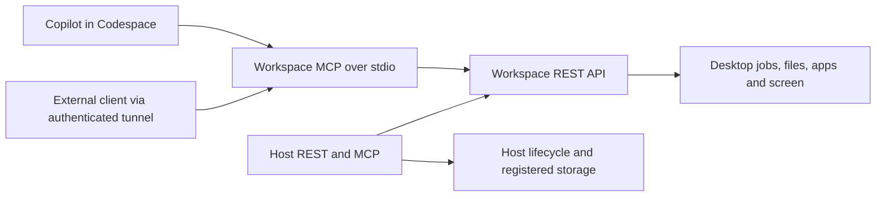

# Agent access redesign proposal

Status: proposed, 21 September 2026. This branch preserves the existing runner/MCP
implementation and adds the shared source mount. The interfaces below are the
next design checkpoint, not capabilities already shipped. Working assumption:
both Codespace-local and external agents matter.

## Product contract

Opening a Codespace should give a human and an agent one identifiable workspace:
the same Git checkout, a running graphical desktop, discoverable tools, and clear
readiness. The source is `/workspaces/vibestack` in the editor and
`/projects/vibestack` in the desktop. Other projects retain their persistent tree.
A successful source edit is immediately visible from both environments; it does
not rebuild the running VibeStack image automatically.

An agent should be able to discover the workspace, run a bounded command, inspect
its job/output, read and edit project files, inspect the desktop, operate known
apps/windows, and recover a failed service. Creating or destroying desktops is a
separate host capability. A Codespace with one desktop must not need a multi-tenant
host broker simply to expose its desktop tools.

## Two services, one operation model

| Surface | Responsibility | Existing implementation | Proposed change |
|---|---|---|---|
| Workspace API | Work inside one desktop: jobs, files, screenshots, apps/windows, clipboard, status | Python `/api/v1/automation`, plus control routes | Keep REST v1 compatible; publish an explicit operation/capability inventory |
| Workspace MCP | Agent tools for the same desktop | No direct workspace MCP; runner exposes a subset through mediation | Add a thin MCP adapter backed by the same workspace client/operations |
| Host API/MCP | Provision/select/start/stop/update desktops and registered storage | Go runner `/api/v1/runner` and `/mcp` | Preserve this separate authority; reuse workspace operations for mediation |
| Human setup | Passwords, account sign-in, permission approval | Same-origin setup UI and explicit CLI password flow | Keep outside MCP arguments, results, prompts and job records |

The immediate adapter can call the tested REST client. It must not reimplement
command execution, file boundaries, authorization or Docker access. If server
logic later moves into a shared operation layer, REST and MCP must call that same
layer. Do not introduce separate authorization rules for each transport.

## Local and remote transport

For Copilot in the Codespace, prefer an outer-process stdio adapter configured
through Dev Container MCP settings. It connects to loopback port 8080 and obtains
a workspace credential through an explicit approved local connection mechanism;
secrets stay out of checked-in configuration and stdout. A proposed command is
`vibestack mcp --workspace URL --credential-file PATH`; this command is not yet
implemented. The adapter itself should not receive the Docker socket merely to
run workspace tools. Local bootstrap may use the existing trusted Docker-host
helper to provision a restricted local credential, without printing it.

For a developer's external client, prefer an authenticated Codespaces SSH/tunnel
or stdio bridge so GitHub authentication stays in the user's GitHub CLI context.
Keep application authorization in addition to transport authentication. The
existing paired private-tailnet host endpoint remains supported.

A private `app.github.dev` URL is not a universally usable remote MCP URL:
GitHub forwarding authentication and VibeStack authorization are separate layers.
GitHub documents `X-Github-Token` for programmatic forwarded-port access; that
session credential must not be baked into MCP config or handed to an unrelated
hosted agent. Clients unable to run a local bridge need an explicit remote-gateway
and authorization design. Do not make the desktop port public to solve this.
OAuth discovery, audience-bound credentials, revocation and gateway ownership
remain a separate decision before supporting arbitrary hosted MCP consumers.

VS Code documents Dev Container MCP configuration under
`customizations.vscode.mcp`, with servers running in their configured remote
context. Preserve its workspace/server trust and tool approval prompts. Different
Copilot harnesses can read different configuration locations; test the actual
selected harness instead of assuming one JSON file configures all of them.

## Identity, readiness and errors

- Discovery describes workspace ID, instance ID when managed, version, project
  roots, paths in each environment, endpoint reachability and capabilities.
- Readiness distinguishes container health, desktop connection, restoration,
  human onboarding and optional app availability. A healthy container does not
  imply a password or app account has been configured.
- A single-workspace connection binds its workspace once. Multi-instance host
  operations always require an explicit instance ID; never use a mutable global
  current-instance value shared between agents.
- Commands return job IDs and bounded output cursors. Host provisioning returns
  operation IDs. Keep their namespaces and terminal states distinct; retries of
  mutating lifecycle operations need explicit idempotency keys.
- Return stable error codes, request IDs, retryability and human-action URLs.
  Do not return secrets or unrestricted log/file content in errors.
- V1 workspace credentials currently carry broad workspace authority. Do not
  advertise fine-grained scopes merely because tools have separate names:
  arbitrary command execution can read/write files and credentials as `vibe`.
  Any future restricted/read-only role needs real enforcement and independent tests.

## Tool coverage and boundaries

Start with workspace discovery/status; command submit/get/output/cancel; project
file read/write with existing preconditions; screenshot; app/window operations;
and bounded service diagnostics. Add shell execution explicitly, not as an
implicit conversion from argv. Clipboard and credential-adjacent operations need
clear tool annotations and deliberate enablement. Password submission, raw Docker,
arbitrary proxy destinations and volume purge remain outside MCP.

Generate or validate a coverage table across REST, CLI and MCP from one operation
inventory. The current runner MCP exposes command/job/output/screenshot tools,
not every workspace REST capability. Mark gaps explicitly. Preserve REST/CLI
compatibility while adding the adapter; avoid renaming working endpoints first.

The new source bind is explicit and writable. It includes Git metadata and any
repository files; it does not mount the outer home or inject GitHub environment
credentials. Source and project ownership must stay intact. Existing file API
no-follow, owner and same-filesystem checks remain enforced. If registered
projects later span devices, authorize explicit project roots rather than
weakening traversal checks globally. Concurrent agents still need Git/worktree
coordination; sharing files does not resolve concurrent-edit conflicts.

## Implementation sequence and acceptance

1. Preserve existing broker work in this draft; verify source mapping in a real
   Codespace in both directions, after replacement/rebuild, and with an occupied
   destination. Keep source edits separate from desktop runtime/image updates.
2. Agree the workspace/host split and supported external client classes. Add an
   operation coverage inventory and workspace discovery contract.
3. Implement the workspace stdio adapter over the current REST client, with local
   credential bootstrap and a minimal Dev Container configuration. Verify real
   Copilot tool discovery, command execution and a screenshot, without secrets
   in logs/configuration or approval bypasses.
4. Test an independent external client over an authenticated tunnel, including
   credential revocation, wrong workspace/Origin, service restart, job polling,
   cancellation, output limits and file precondition conflicts.
5. Design a remote gateway only if hosted clients need one. Keep legacy broker
   clients working while migrating; mark draft ready only after exact-commit CI
   and independent-client checks pass.

## Primary references

- [VS Code MCP servers and Dev Containers](https://code.visualstudio.com/docs/agent-customization/mcp-servers)
- [VS Code MCP configuration and remote contexts](https://code.visualstudio.com/docs/agents/reference/mcp-configuration)
- [GitHub private port forwarding and programmatic access](https://docs.github.com/en/codespaces/developing-in-a-codespace/forwarding-ports-in-your-codespace)
- [GitHub Codespaces security](https://docs.github.com/en/codespaces/reference/security-in-github-codespaces)
- [MCP stdio transport](https://github.com/modelcontextprotocol/modelcontextprotocol/blob/main/docs/specification/2026-07-28/basic/transports/stdio.mdx)

Current code entrypoints: `automation/server.py`, `automation/automationlib.py`,
`pkg/vibestack/client.go`, `runner/server.go`, `runner/mcp.go`, and
`api/command-coverage.json`. Pin protocol behavior to the installed SDK and
negotiate supported versions; a newer published specification is not proof that
the installed client or server implements it.
