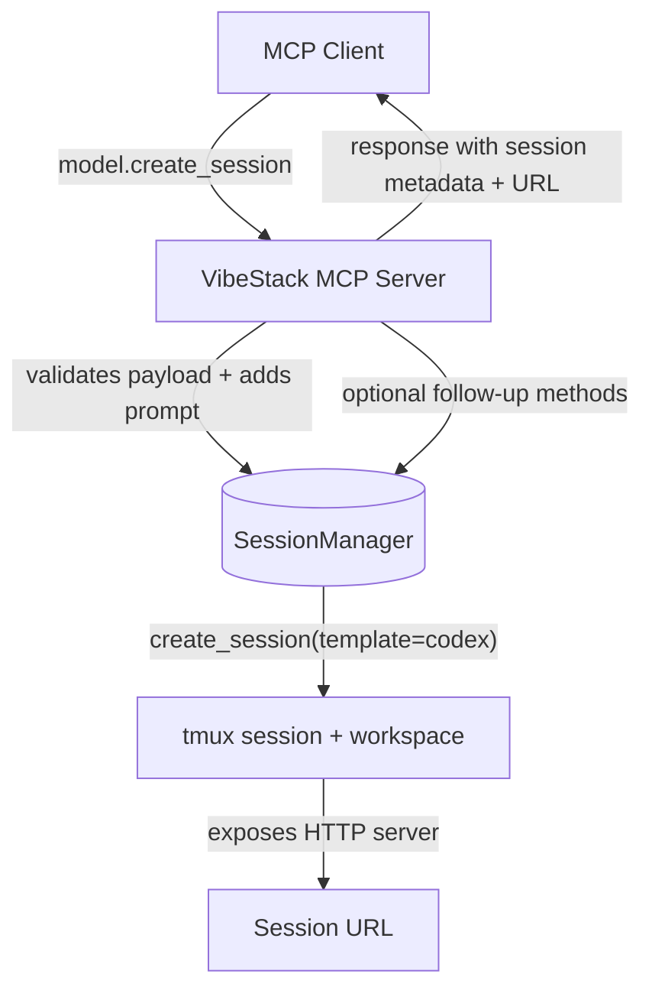

# VibeStack MCP Session Integration

## Overview

This document captures the planned work to expose the existing VibeStack session API over an MCP interface. The goal is to let remote MCP clients (such as Codex) request new sessions, send prompts, and follow the session via a returned URL.

## Architecture Diagram

## Key Flows

1. The MCP client issues `model.create_session` with a session `name`, optional `prompt`, and overrides.
2. The MCP server maps this to `vibestack.api.create_session`, defaulting to the `codex` template.
3. The Session Manager provisions tmux sessions, seeds workspace files, and launches the Codex CLI.
4. The MCP server returns the metadata plus the externally accessible URL for the session log/stream.

## Implementation Notes

- The server lives in `vibestack/mcp/server.py` and is registered with Supervisor as `vibestack-mcp`.
- Runtime access is proxied through Nginx at `/mcp/`, backed by `uvicorn` on port `9100` inside the container.
- Tools mirror the REST API surface: sessions, jobs, template management, log tailing, and interactive input.
- `create_session` accepts an optional `prompt`; when provided it is sent directly to the tmux pane after launch.
- Follow-along URLs default to the ttyd terminal. Override via `VIBESTACK_SESSION_FOLLOW_BASE` or `VIBESTACK_SESSION_FOLLOW_PATH`.
- Transport uses the MCP streamable HTTP handshake (POST/GET/DELETE on `/mcp`) so modern clients can resume sessions and receive `Mcp-Session-Id` headers.
- For quick smoke tests, run `python3 examples/mcp_runner.py` once the container is live (see `docs/services/mcp.md`).

## Environment Variables

| Variable | Purpose | Default |
| --- | --- | --- |
| `VIBESTACK_MCP_PORT` | Internal port where the MCP uvicorn server listens | `9100` |
| `VIBESTACK_MCP_DEFAULT_TEMPLATE` | Template name used when `create_session` is called without a template | `codex` |
| `VIBESTACK_SESSION_FOLLOW_BASE` | Optional absolute URL prefix for follow-along links | unset |
| `VIBESTACK_SESSION_FOLLOW_PATH` | Override for the path portion of follow-along links | `/terminal/` |
